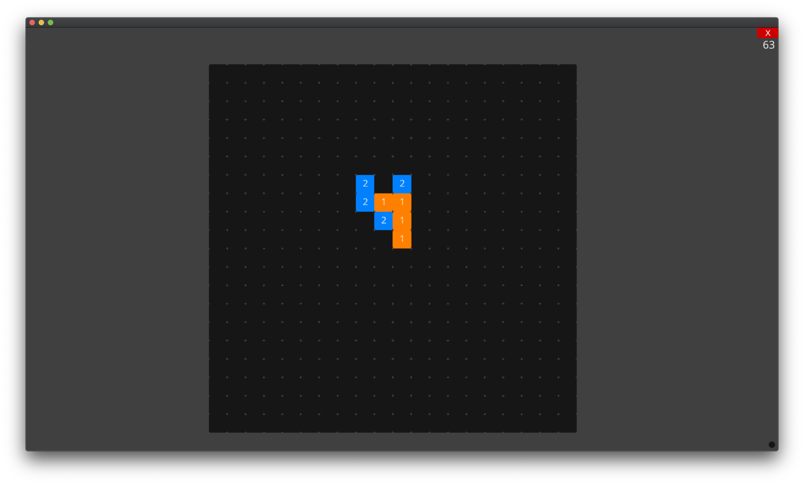

# Omok-AI

A.I. playing Omok (a.k.a. Gomoku, Renju)

## Train

1. Download dataset from https://gomocup.org/results (I used gomocup2019results Freestyle dataset for pretrained models)
2. Set `game_rule` and `base_path` in [create_dataset.py](create_dataset.py)

    Game rules
    - Freestyle
    - Fastgame
    - Standard
    - Renju

3. `python create_dataset.py`
4. Run [train_cnn.ipynb](train_cnn.ipynb)

## Test

1. `python gui.py`

## Dependency

- Python 3
- TensorFlow 2.3.1
- [ursina](https://github.com/pokepetter/ursina/) 3.2.2 (for GUI)
- sckit-learn

### I have a question

I tried to train a network with [NEAT](https://github.com/CodeReclaimers/neat-python/) but failed. I'd be really glad you give me a feedback for [train_neat.py](train_neat.py)